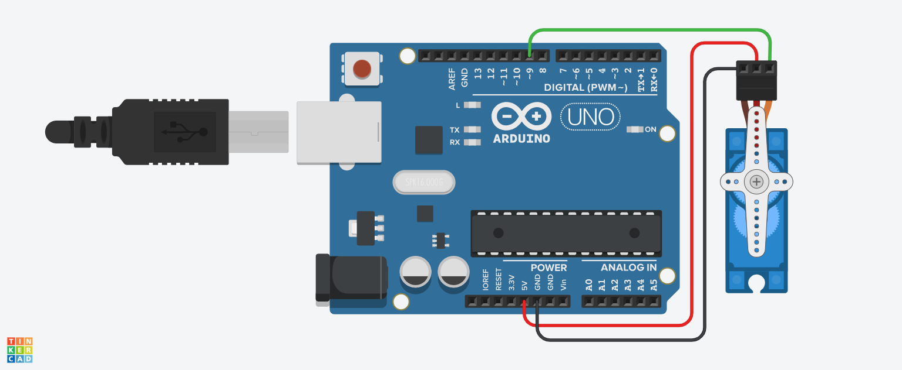

# Servomotor - Ângulos

Este projeto usa um servomotor para explorar conceitos de ângulos e movimento em Matemática.

## Descrição

Este projeto busca tratar de forma prática e visual os conhecimentos acerca de ângulos, a partir do uso do servomotor.

## Link do Projeto

[Servomotor - ângulos no Tinkercad](https://www.tinkercad.com/things/ihFTJxoK3R6/editel?returnTo=%2Fdashboard&sharecode=xdFQix-XCh66tT7lP3372PfNzGmalRCQVMZ4ZwCaA2E)

## Características

- Codificação em blocos para facilitar o entendimento.
- Uso de um micro servomotor para demonstrar ângulos.
- Visualização da relação entre grau e giro.

## Como usar

1. Abra o projeto no Tinkercad.
2. Estude o código e o movimento do servomotor.
3. Experimente mudar os valores de ângulo.

## Arquivo do projeto

- `servomotor.ino`

## Materiais

- Arduino Uno R3
- Micro servomotor

## Imagem

